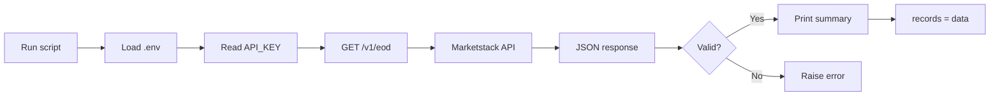
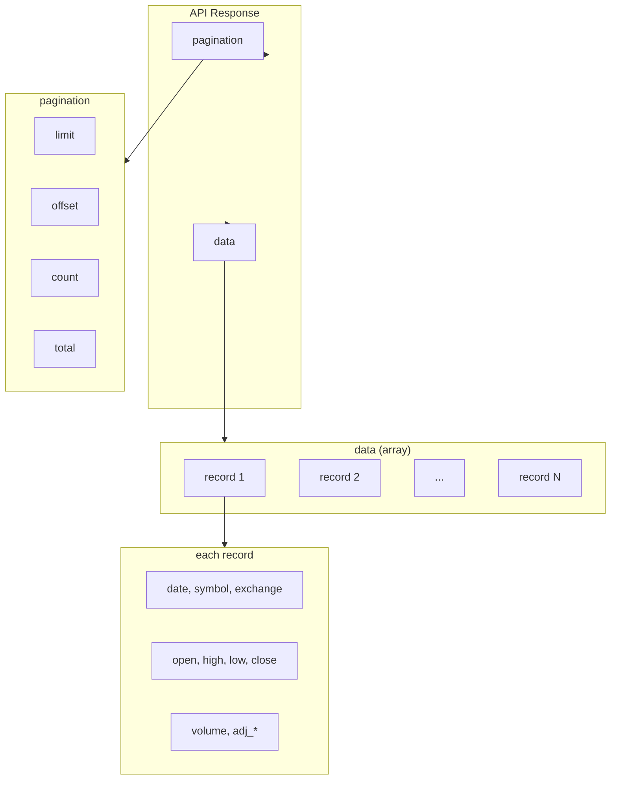

# My Good Query — Script Documentation

Documentation for `my_good_query.py`: a Python script that fetches end-of-day (EOD) stock data from the Marketstack API for use in reporter applications.

---

## Overview

`my_good_query.py` requests **time-series data** (the 20 most recent trading days for a single symbol) from the [Marketstack API](https://marketstack.com/) (APILayer). The script loads an API key from a local `.env` file, performs a GET request with required and optional parameters, validates the response, and exposes a list of records suitable for downstream reporting (e.g., daily summaries, trend charts, or multi-day analysis).

**Use case:** Daily stock reports, recent-trend summaries, and filtered datasets of at least 10–20 rows for analysis or dashboards.

---

## API Endpoint & Parameters

| Item | Value |
|------|--------|
| **API name** | Marketstack (APILayer) |
| **Method** | GET |
| **Endpoint** | `https://api.marketstack.com/v1/eod` |
| **Documentation** | [Marketstack API docs](https://docs.apilayer.com/marketstack/docs/api-documentation) |

### Parameters

| Parameter | Required | Description |
|-----------|----------|-------------|
| `access_key` | Yes | API key (from `.env` as `API_KEY`). |
| `symbols` | Yes | Comma-separated ticker(s). Script uses `AAPL`. |
| `limit` | No | Max results per request (default 100). Script uses `20`. |
| `date_from` | No | Start date (YYYY-MM-DD). Not used in script. |
| `date_to` | No | End date (YYYY-MM-DD). Not used in script. |

---

## Data Structure

The API returns a JSON object with two top-level keys:

- **`pagination`** — Metadata for the current response:
  - `limit`, `offset`, `count`, `total`
- **`data`** — Array of EOD records (one per trading day).

Each element in `data` is an object with fields such as:

| Field | Description |
|-------|-------------|
| `date` | Trading date (ISO 8601). |
| `symbol` | Ticker (e.g., `AAPL`). |
| `exchange` | Exchange code (e.g., `XNAS`). |
| `open` | Opening price. |
| `high` | High price. |
| `low` | Low price. |
| `close` | Closing price. |
| `volume` | Trading volume. |
| `adj_open`, `adj_high`, `adj_low`, `adj_close`, `adj_volume` | Adjusted values. |
| `split_factor`, `dividend` | Corporate action fields. |

The script ensures at least 10 records are returned and exposes the list as `records` for use by a reporter.

---

## Flow Diagram



---

## Response Structure Diagram



---

## Usage Instructions

### Prerequisites

- Python 3 with `requests` and `python-dotenv` installed:
  ```bash
  pip install requests python-dotenv
  ```
- A Marketstack API key from [marketstack.com](https://marketstack.com) (free tier available).

### Setup

1. In the **`01_query_api`** folder, create or edit a `.env` file.
2. Add your key (no spaces around `=`):
   ```bash
   API_KEY=your_marketstack_access_key_here
   ```
3. Keep `.env` out of version control (it should be in `.gitignore`).

### Run the Script

From the **project root** (`dsai`):

```bash
python 01_query_api/my_good_query.py
```

Or from inside `01_query_api`:

```bash
cd 01_query_api
python my_good_query.py
```

### Expected Output

- A short summary including:
  - Number of records returned (e.g., 20).
  - Pagination `limit` and `total`.
  - Key field names.
  - A sample (first) record.
- The variable `records` holds the list of EOD dicts for use in your reporter (e.g., pandas DataFrame, templates, or charts).

### Errors

- **`API_KEY not found in .env`** — Add `API_KEY=...` to `01_query_api/.env`.
- **Marketstack API error (status / body)** — Check key validity, quota, and endpoint URL.
- **No data / fewer than 10 records** — Check `symbols` and (if used) date range; free tier may limit history.

---

## Related

- Lab: [LAB_your_good_api_query.md](LAB_your_good_api_query.md)
- Script: [my_good_query.py](my_good_query.py)
