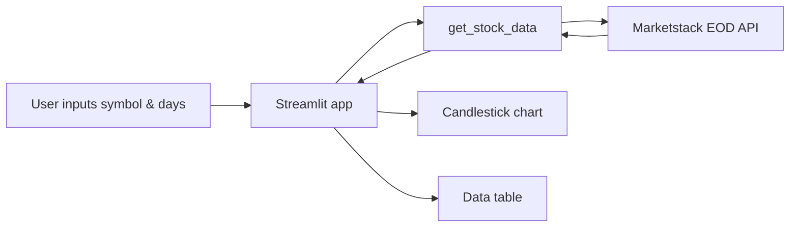

# 📈 Marketstack Data Reporter


---

## Table of Contents

- [🧐 About](#-about)
- [🏗️ Architecture](#️-architecture)
- [🛠️ Tech Stack](#️-tech-stack)
- [🚀 Getting Started](#-getting-started)
- [📉 Results/Demo](#-resultsdemo)

---

## 🧐 About

**Marketstack Data Reporter** is a Streamlit app for analyzing daily stock trends using end-of-day (EOD) data from the [Marketstack](https://marketstack.com) API. You choose a symbol and date range, view an interactive candlestick chart, and inspect the raw OHLCV table.

- **Candlestick chart** — Plotly candlestick (Open, High, Low, Close) for the selected symbol and range.
- **Metrics** — Configurable symbol and “days to retrieve” (10–100); responses are cached for 5 minutes to limit API calls.
- **Data table** — Raw EOD data (date, symbol, open, high, low, close, volume) in a sortable dataframe below the chart.

---

## 🏗️ Architecture

Data flows from the Marketstack API into the app via a cached fetch function; Streamlit renders inputs, the chart, and the table.



### Project layout

```text
.
├── app.py
├── my_good_query.py
├── requirements.txt
├── README.md
├── app_screenshot.png
├── candlestick_chart.png
└── data_table.png
```

---

## 🛠️ Tech Stack

| Layer        | Technology     | Role |
|-------------|----------------|------|
| App         | Streamlit      | UI, inputs, caching |
| Data        | Pandas         | EOD dataframe, table |
| Charts      | Plotly         | Candlestick (OHLC)   |
| API         | requests       | Marketstack EOD GET  |
| Config      | python-dotenv  | Load API_KEY from .env |

---

## 🚀 Getting Started

### Install dependencies

Run from this folder so `requirements.txt` is found:

```bash
pip install -r requirements.txt
```

### API configuration

The app needs a Marketstack API key.

1. Get a free key from [marketstack.com](https://marketstack.com).
2. Create a file named **`.env`** in this folder (`02_productivity/stock_app/`) or the parent (`02_productivity/`).
3. Add one line (no spaces around `=`):

   ```bash
   API_KEY=your_actual_marketstack_key_here
   ```

4. Replace the value with your key. Do not commit `.env` (it is in `.gitignore`). The app loads `.env` from the app folder first, then the parent.

### Run the app

```bash
streamlit run app.py
```

---

## 📉 Results/Demo

### Main dashboard


### Candlestick chart


### Data table


