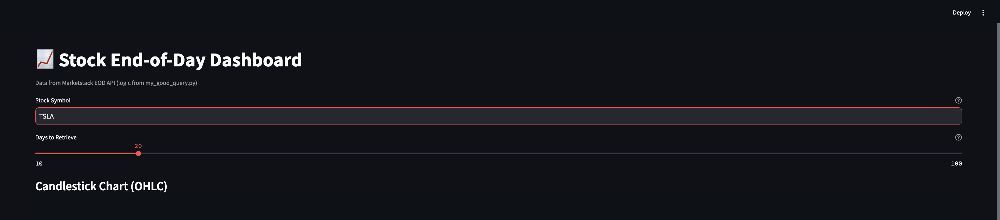
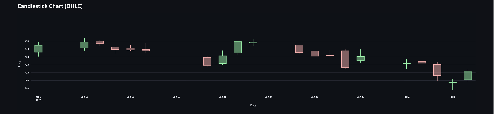
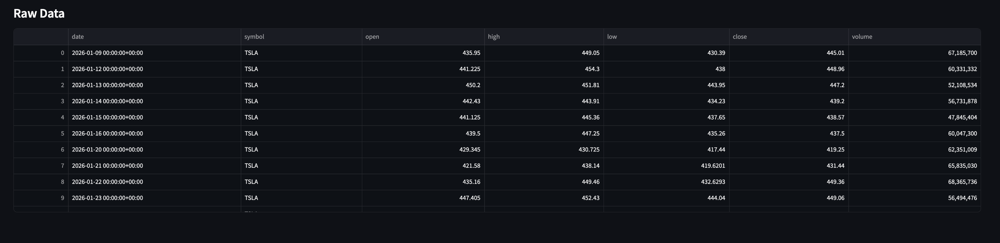

# Marketstack Data Reporter

A Streamlit app for analyzing daily stock trends using end-of-day (EOD) data from the [Marketstack](https://marketstack.com) API. Choose a symbol and date range, view a candlestick chart, and inspect the raw OHLCV table.

---

## Setup

Install dependencies (run from this folder):

```bash
pip install -r requirements.txt
```

Then start the app:

```bash
streamlit run app.py
```

---

## API Configuration

The app needs a Marketstack API key to fetch data.

1. Get a free API key from [marketstack.com](https://marketstack.com).
2. In this folder (`02_productivity/stock_app/`) or the parent folder (`02_productivity/`), create a file named **`.env`**.
3. Add a single line (no spaces around `=`):

   ```
   API_KEY=your_actual_marketstack_key_here
   ```

4. Replace `your_actual_marketstack_key_here` with your key. Do not commit `.env` to git (it is in `.gitignore`).

The app looks for `.env` in `02_productivity/stock_app/` first, then in `02_productivity/`, so you can use one key for multiple tools in this section.

---

## Features

- **Candlestick chart** — Interactive Plotly candlestick (Open, High, Low, Close) for the selected symbol and range.
- **Metrics** — Configurable stock symbol and “days to retrieve” (10–100); responses are cached for 5 minutes to limit API calls.
- **Data table** — Raw EOD data (date, symbol, open, high, low, close, volume) in a sortable dataframe below the chart.

---

## Screenshots

### Main dashboard



### Candlestick chart



### Data table


