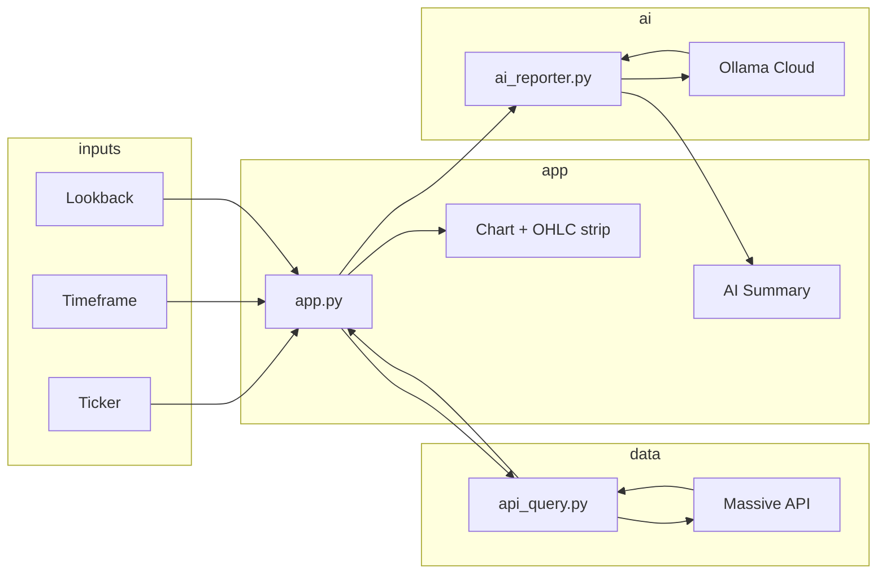

# 📊 Homework 1: AI-Powered Reporter


> TradingView-style chart app: Massive API (OHLC), Streamlit UI, and Ollama Cloud AI summaries. Single deliverable for HW1.

---

## Table of Contents

- [🧐 About](#-about)
- [🏗️ Architecture](#️-architecture)
- [📋 Data Summary](#-data-summary)
- [🛠️ Tech Stack](#️-tech-stack)
- [🚀 Getting Started](#-getting-started)
- [📉 Usage](#-usage)
- [📁 Project Layout](#-project-layout)

---

## 🧐 About

This folder is the **HW1 deliverable**: an AI-powered stock reporter that combines:

- **API**: [Massive](https://massive.com) for previous-close and range aggregates (1m, 5m, 1D, etc.).
- **UI**: Streamlit app with an expandable sidebar for Ticker, Timeframe, and Start/End Calendars. Features a responsive Candlestick + Volume chart and native metric tracking.
- **AI**: [Ollama Cloud](https://ollama.com) to generate professional, multi-timeframe Technical Analysis summaries encompassing price action, RSI, and Moving Averages.

All logic lives in this directory; keys are read from `.env` (see [Getting Started](#-getting-started)).

---

## 🏗️ Architecture



- User sets **Ticker**, **Timeframe** (1m–1D/1W), and explicit **Start/End Dates** in the app's sidebar. `app.py` calls [`api_query.py`](api_query.py) to fetch bars from Massive, renders the interactive chart, calculates TA indicators (SMA, EMA, RSI) locally, and (on demand) calls [`ai_reporter.py`](ai_reporter.py) for an Ollama Cloud Technical Analysis summary.

---

## 📋 Data Summary

Massive **previous close** and **range aggregates** return OHLCV per bar. The app uses:

| Column   | Type   | Description                                      |
|----------|--------|--------------------------------------------------|
| `ticker` | string | Symbol (e.g. AAPL, MSFT).                        |
| `open`   | number | Open price for the bar.                          |
| `high`   | number | High price.                                      |
| `low`    | number | Low price.                                       |
| `close`  | number | Close price.                                     |
| `volume` | number | Volume.                                          |

---

## 🛠️ Tech Stack

- **Python**: 3.9+
- **APIs**: Massive (Stocks), Ollama Cloud (chat).
- **Key packages**: `streamlit`, `pandas`, `plotly`, `python-dotenv`, `requests`, `massive` (see [`requirements.txt`](requirements.txt)).
- **Secrets**: `.env` with `MASSIVE_API_KEY` and `OLLAMA_API_KEY` (copy from [`.env.example`](.env.example) if present).

---

## 🚀 Getting Started

1. **Install dependencies** (from this folder):

   ```bash
   cd 03_query_ai/hw1
   pip install -r requirements.txt
   ```

2. **Configure API keys**  
   Copy `.env.example` to `.env` and set:

   - `MASSIVE_API_KEY` — from [Massive](https://massive.com).
   - `OLLAMA_API_KEY` — from [Ollama Cloud](https://ollama.com).

3. **Run the app**:

   ```bash
   streamlit run app.py
   ```

   Open the URL in the terminal (e.g. `http://localhost:8501`).

---

## 📉 Usage

- **App**: Open the Sidebar to choose **Ticker**, **Timeframe** (1m, 5m, 15m, 30m, 1H, 4H, 1D, 1W), and explicit **Start / End** dates using the calendar widgets. Use the tabs at the bottom to view the **Data Table** or click **Generate Report** within the **AI Report** tab for a Technical Analysis summary.
- **Standalone scripts** (optional):
  - Test API: `python api_query.py`
  - Test AI report: `python ai_reporter.py`

---

## 📁 Project Layout

```text
.
├── app.py           # Streamlit app (chart, AI summary)
├── api_query.py     # Massive API: previous close + get_aggs_bars()
├── ai_reporter.py   # Ollama Cloud report from OHLC data
├── requirements.txt
├── README.md
├── HOMEWORK1.md     # Assignment instructions
└── .env             # MASSIVE_API_KEY, OLLAMA_API_KEY (create from .env.example)
```

---


← 🏠 [Back to Top](#table-of-contents)
