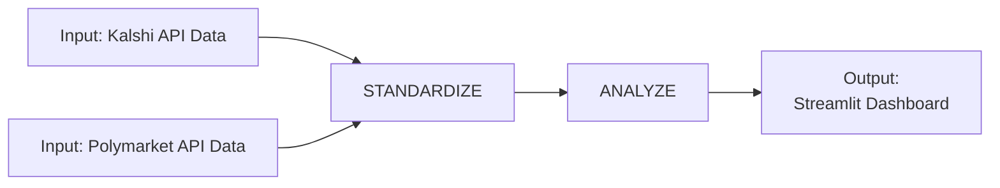

# Process diagram: dual-market pipeline

## Stakeholder needs → System goals

| Stakeholder need | System goal (pipeline stage) |
|------------------|------------------------------|
| Compare odds across Kalshi and Polymarket | Ingest both **Kalshi API** and **Polymarket API** data as parallel inputs |
| Use a single, consistent view of events and prices | **STANDARDIZE**: normalize schemas, units, and identifiers so both sources are comparable |
| Identify mispricings or arbitrage opportunities | **ANALYZE**: run dislocation logic and thresholds on standardized data |
| Review results and act on findings | **Output**: provide a **Streamlit Dashboard** for visualization and decision support |

---

