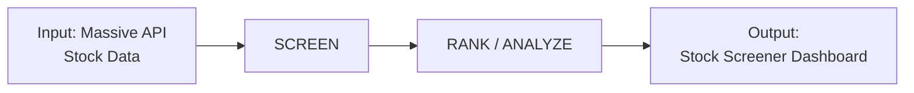

# Process diagram: stock screener pipeline

## Stakeholder needs → System goals

| Stakeholder need | System goal (pipeline stage) |
|------------------|------------------------------|
| Access live or historical stock data | Pull stock data from **Massive API** (input) |
| Filter stocks by criteria (e.g., price, volume, fundamentals) | **SCREEN**: apply filters and thresholds |
| Rank and analyze candidates | **RANK / ANALYZE**: score, sort, and compare screened results |
| View results and compare candidates | **Output**: **Stock Screener Dashboard** for exploration and selection |

---

