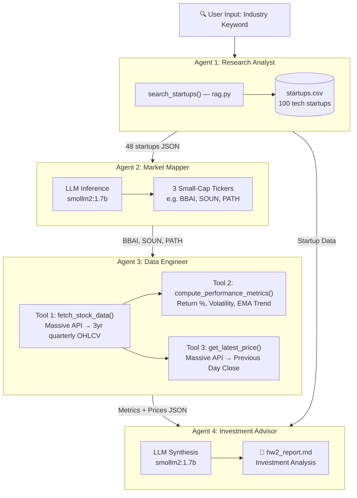

# Homework 2: AI Agent System with RAG and Tools

**Danny Atik — SYSEN 5381**

---

## System Description

This system is an AI-powered investment research assistant that combines three core capabilities: multi-agent orchestration, retrieval-augmented generation (RAG), and function calling with external APIs. Given an industry keyword, the system searches a startup database, identifies comparable small-cap publicly-traded stocks using an LLM, fetches three years of quarterly market performance data from the Massive API, computes performance metrics, retrieves latest prices, and produces a comprehensive investment analysis — all through a 4-agent pipeline running on a local LLM via Ollama.

The system was designed around a practical use case: assessing a sector's market potential by combining private startup data with public market performance of comparable small-cap companies. Agent 1 uses RAG to search a CSV database of 100 tech startups by industry and description. Agent 2 uses the LLM to identify comparable small-cap or micro-cap publicly-traded ticker symbols — it is explicitly instructed to avoid mega-caps and find closer startup comparisons. Agent 3 chains together three tool functions per ticker: `fetch_stock_data()` retrieves 3 years of quarterly OHLCV bars, `compute_performance_metrics()` calculates return, volatility, and EMA trend, and `get_latest_price()` fetches the most recent trading day's close. Agent 4 synthesizes both the startup landscape and all market data into a final investment analysis with recommendations.

The main design challenge was managing the Massive API's rate limit (5 calls/min on the free tier). The solution uses `raw=True` to prevent the client library from auto-following pagination cursors, and `limit=50000` to ensure all base daily bars are aggregated into quarterly bars in a single response — guaranteeing exactly 1 API call per ticker for historical data. The `compute_performance_metrics()` tool is a pure computation function (no API call), and `get_latest_price()` uses the lightweight `get_previous_close_agg` endpoint. Tool chaining (fetch → compute → latest) demonstrates a real multi-step function calling workflow.

---

## System Architecture

### Agent Roles and Workflow

| Agent | Role | Method | Module | Input | Output |
|-------|------|--------|--------|-------|--------|
| Agent 1 | Research Analyst | RAG (CSV search) | `rag.py` | Industry keyword | Matching startup records (JSON) |
| Agent 2 | Market Mapper | LLM inference | `agents.py` | Startup list | 3 comparable small-cap tickers |
| Agent 3 | Data Engineer | 3 chained tools | `tools.py` | Ticker symbols | Performance metrics + latest prices |
| Agent 4 | Investment Advisor | LLM synthesis | `agents.py` | All prior agent data | Investment analysis report (markdown) |

**Workflow:** The pipeline executes sequentially — each agent's output feeds the next. Agent 1 searches the startup database via RAG. Agent 2 uses LLM reasoning to identify comparable publicly-traded small-cap stocks. Agent 3 chains three tool functions per ticker (fetch raw data → compute metrics → get latest price). Agent 4 receives all outputs and synthesizes a structured investment analysis.

### Architecture Diagram



---

## RAG Data Source

- **File**: `startups.csv` (included in HW2 directory)
- **Original Source**: `07_rag/LAB/startups.csv`
- **Type**: CSV with 100 fictional tech startups
- **Columns**:

| Column | Type | Description |
|--------|------|-------------|
| Name | string | Company name (e.g. "NeuralForge") |
| Industry | string | Sector (e.g. "AI/ML", "CleanTech", "EdTech") |
| Founded | int | Year founded |
| Employees | int | Number of employees |
| Revenue_M | float | Annual revenue in millions |
| Funding_M | float | Total funding raised in millions |
| Stage | string | Funding stage (Seed, Series A, Series B) |
| HQ | string | Headquarters city |
| Description | string | Business description |

- **Search Function**: `search_startups(query, csv_path)` in `rag.py`
  - Case-insensitive search across Name, Industry, and Description columns
  - Returns all matching rows as a JSON string
  - Example: `search_startups("AI", "startups.csv")` → 48 matches

---

## Tool Functions

| # | Tool | Module | Type | Purpose |
|---|------|--------|------|---------|
| 1 | `search_startups()` | `rag.py` | RAG retrieval | Search startup CSV database by keyword |
| 2 | `fetch_stock_data()` | `tools.py` | API call (Massive) | Fetch 3 years of quarterly OHLCV bars |
| 3 | `compute_performance_metrics()` | `tools.py` | Computation | Calculate return, volatility, EMA from raw price data |
| 4 | `get_latest_price()` | `tools.py` | API call (Massive) | Get previous trading day's OHLCV |

### Tool Details

#### 1. `search_startups(query, csv_path)` — RAG Retrieval
| Parameter | Type | Description |
|-----------|------|-------------|
| `query` | str | Search keyword (e.g. "AI", "fintech") |
| `csv_path` | str | Path to startups CSV file |
| **Returns** | str | JSON string of matching startup records |

#### 2. `fetch_stock_data(ticker, api_key)` — Massive API
| Parameter | Type | Description |
|-----------|------|-------------|
| `ticker` | str | Stock ticker symbol (e.g. "SOUN") |
| `api_key` | str | Massive API key |
| **Returns** | str | JSON with ticker, period, and list of quarterly OHLCV bars |

Uses `multiplier=3, timespan="month"` for quarterly aggregation. `raw=True` prevents auto-pagination (1 API call). `limit=50000` ensures all daily data is used.

#### 3. `compute_performance_metrics(price_data_json)` — Pure Computation
| Parameter | Type | Description |
|-----------|------|-------------|
| `price_data_json` | str | JSON string from `fetch_stock_data()` |
| **Returns** | str | JSON with total return %, annualized return %, volatility %, 3-year high/low, EMA trend, quarterly close history |

No API calls — computes metrics from raw data. Uses numpy for volatility calculation and manual EMA formula.

#### 4. `get_latest_price(ticker, api_key)` — Massive API
| Parameter | Type | Description |
|-----------|------|-------------|
| `ticker` | str | Stock ticker symbol (e.g. "SOUN") |
| `api_key` | str | Massive API key |
| **Returns** | str | JSON with previous day open, high, low, close, volume, daily range % |

Uses the `get_previous_close_agg` endpoint — lightweight, 1 API call.

### Tool Chaining (Agent 3)

For each comparable ticker, Agent 3 chains all three tools:

```
fetch_stock_data("BBAI")          → raw quarterly OHLCV bars
    ↓
compute_performance_metrics(data) → return %, volatility, EMA trend
    ↓
get_latest_price("BBAI")          → previous day's close price
```

This produces 9 total tool calls for 3 tickers.

---

## Technical Details

### Dependencies

| Package | Purpose |
|---------|---------|
| `requests` | HTTP calls to Ollama |
| `pandas` | CSV loading and filtering for RAG |
| `numpy` | Statistical computations (volatility) |
| `python-dotenv` | Load API keys from `.env` |
| `massive` | Massive API client library |

### API Keys

| Key | Source | Purpose |
|-----|--------|---------|
| `MASSIVE_API_KEY` | [Massive API](https://massivecorp.com) | Stock market data (OHLCV bars, previous close) |

API key must be set in a `.env` file (see `.env.example`).

### LLM

- **Model**: `smollm2:1.7b`
- **Runtime**: Ollama (local, runs on `localhost:11434`)
- **Used By**: Agent 2 (ticker matching) and Agent 4 (investment analysis)

### File Structure

All files are self-contained in the `HW2/` directory:

```
HW2/
├── hw2_system.py        ← Main entry point (ties all modules together)
├── agents.py            ← Multi-agent orchestration (prompts + pipeline)
├── rag.py               ← RAG search implementation
├── tools.py             ← Tool/function calling definitions (3 tools)
├── functions.py         ← Shared LLM agent helpers (agent_run)
├── startups.csv         ← RAG data source (100 tech startups)
├── 01_ollama.py         ← Ollama server launcher
├── hw2_report.md        ← Generated investment report (output)
├── README.md            ← This documentation
└── .env.example         ← Template for API keys
```

### Rate Limit Strategy

The Massive API free tier allows 5 calls/min. The system avoids rate limits by:

1. **`raw=True`** — prevents the client library from auto-following pagination cursors (which consumed hidden API calls)
2. **`limit=50000`** — ensures all base daily bars are aggregated server-side into ~12 quarterly bars in a single response
3. **Quarterly aggregation** — `multiplier=3, timespan="month"` reduces data points vs weekly/daily bars
4. **20-second delays** between tickers to stay under the rate limit

---

## Usage Instructions

### 1. Install Dependencies

```bash
pip install requests pandas numpy python-dotenv massive
```

### 2. Set Up API Key

Create a `.env` file in the project root (or in the `HW2/` directory):

```bash
cp .env.example .env
```

Edit `.env` and add your Massive API key:

```
MASSIVE_API_KEY=your_key_here
```

Get a free API key at [massivecorp.com](https://massivecorp.com).

### 3. Install Ollama and Pull Model

Install Ollama from [ollama.com](https://ollama.com), then pull the model:

```bash
ollama pull smollm2:1.7b
```

### 4. Run the System

```bash
cd 08_function_calling/HW2
python hw2_system.py
```

### 5. Expected Output

The system prints results for each agent:

```
🤖 AGENT 1: Research Analyst — RAG Startup Search for 'AI'
✅ Found 48 startups matching 'AI'

🤖 AGENT 2: Market Mapper — Finding Comparable Small-Cap Tickers
✅ Comparable public companies: BBAI, SOUN, PATH

🤖 AGENT 3: Data Engineer — Using Tools to Analyze Market Data
   📡 [BBAI] Tool 1: fetch_stock_data... 9 quarterly bars
   📊 [BBAI] Tool 2: compute_performance_metrics... Return: 138.67% | Vol: 93.89%
   💲 [BBAI] Tool 3: get_latest_price... Close: $4.25
   ...

🤖 AGENT 4: Investment Advisor — Generating Investment Analysis
📝 Investment Analysis: ...

📄 Report saved to: hw2_report.md
```

A markdown report is saved to `hw2_report.md` with the full pipeline summary and investment analysis.

> **Note**: Full execution takes ~1–2 minutes due to API rate limit delays between tickers.

---

## Git Repository Links

- **Main system file**: [hw2_system.py](https://github.com/datik01/SYSEN5381-DSAI/blob/main/08_function_calling/HW2/hw2_system.py)
- **Multi-agent orchestration**: [agents.py](https://github.com/datik01/SYSEN5381-DSAI/blob/main/08_function_calling/HW2/agents.py)
- **RAG implementation**: [rag.py](https://github.com/datik01/SYSEN5381-DSAI/blob/main/08_function_calling/HW2/rag.py)
- **Function calling / tool definitions**: [tools.py](https://github.com/datik01/SYSEN5381-DSAI/blob/main/08_function_calling/HW2/tools.py)
- **Startup data source**: [startups.csv](https://github.com/datik01/SYSEN5381-DSAI/blob/main/08_function_calling/HW2/startups.csv)
- **Shared helper functions**: [functions.py](https://github.com/datik01/SYSEN5381-DSAI/blob/main/08_function_calling/HW2/functions.py)
