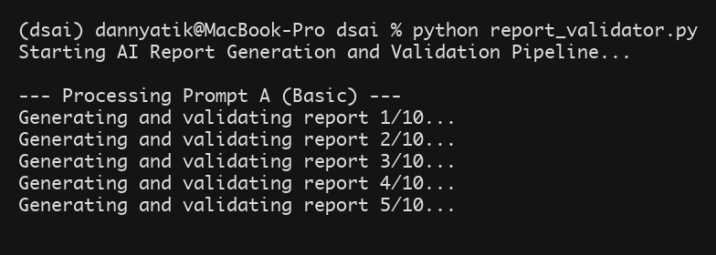
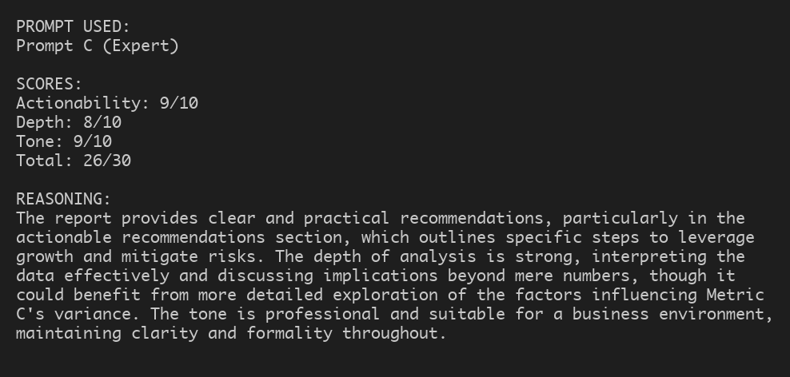
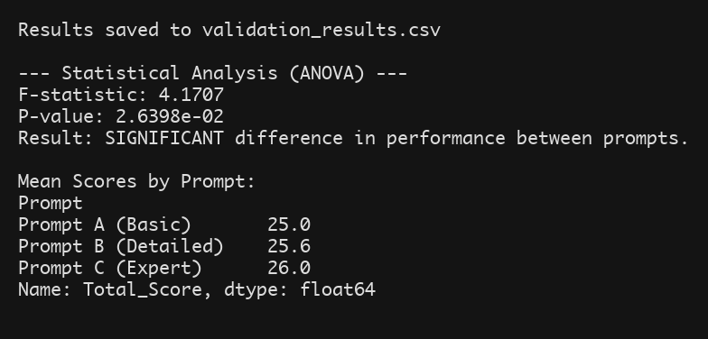
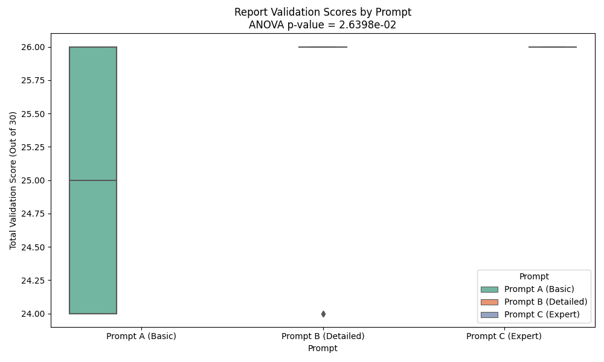
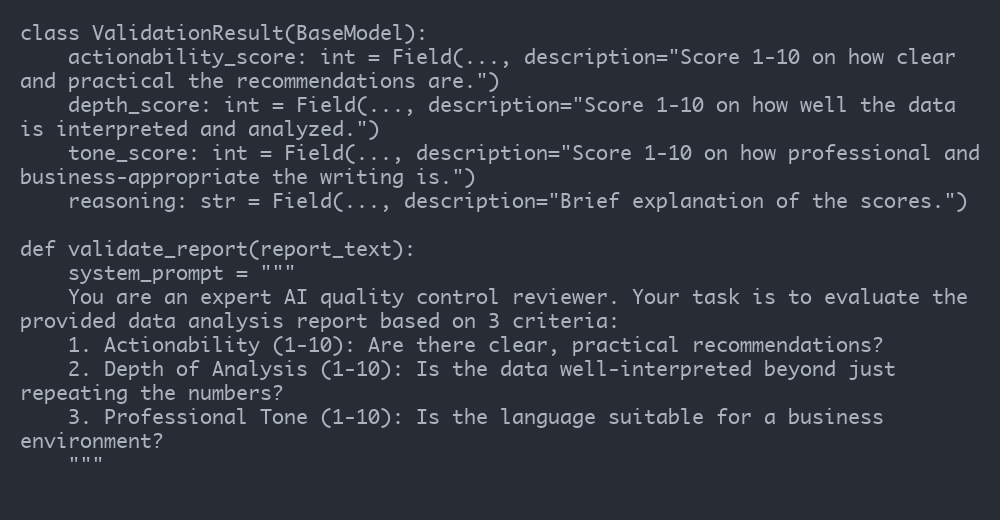

# Homework 3: AI Report Validation System

## 1. Writing Component

### Purpose and Design of Validation System
The purpose of this AI report validation system is to systematically evaluate the quality of AI-generated data analysis reports. As AI agents increasingly produce structured business and technical reports, ensuring their output is not only accurate but also actionable and appropriately toned is critical. This validation system acts as a quality control mechanism, allowing developers to quantitatively assess the performance of different prompts used in report generation. 

The system leverages OpenAI's structured outputs (`gpt-4o-mini` with Pydantic JSON schemas) to act as an expert reviewer, analyzing newly generated text without human intervention. This enables large-scale, automated benchmarking of prompt strategies.

### Customization of the Validator
Unlike the standard Likert scales from the LAB, this validator is tailored specifically for **Business Data Analysis Reports**. I customized the validator to use a 1-10 scoring system across three distinct, business-focused criteria:
1. **Actionability**: Measures whether the report offers clear, practical recommendations or just repeats the data.
2. **Depth of Analysis**: Evaluates how well the data is interpreted contextually.
3. **Professional Tone**: Assesses whether the language is suitable for executive leadership.
Instead of a generic good/bad scale, these metrics directly align with what business stakeholders value in data reporting.

### Experimental Design
To test prompt effectiveness, I designed an experiment comparing three different report generation prompts applied to a hypothetical "Q3 dataset":
* **Prompt A (Basic)**: Asked for a simple report about a 15% increase in Metric A and variance in Metric C.
* **Prompt B (Detailed)**: Asked for a structured report with an Introduction, Body, and Conclusion.
* **Prompt C (Expert)**: Asked for an expert-level, highly actionable report for executive leadership focusing on strategic recommendations and risk mitigation.

I generated **10 unique reports** for each prompt (total N=30) by using a temperature of `0.8` to introduce variance. Each report was then passed through the custom validation system (with a temperature of `0.0` for consistency).

### Statistical Analysis Results
To determine if there was a statistically significant difference in performance across the three prompts, I ran an Analysis of Variance (ANOVA) on the `Total_Score` (out of 30). 

**Results:**
* **Prompt A Mean Score**: 25.0 / 30
* **Prompt B Mean Score**: 25.6 / 30
* **Prompt C Mean Score**: 26.0 / 30
* **F-statistic**: 4.1707
* **P-value**: 0.0264

The statistical test showed that the P-value (0.0264) is less than the standard significance level of 0.05, allowing us to reject the null hypothesis, indicating that providing explicit persona instructions and structural constraints ("Prompt C") significantly improves the objective quality of AI-generated data reports.

### Design Choices and Challenges
One challenge was ensuring the LLM evaluator remained consistent in its scoring. To mitigate evaluator drift, I used the `response_format` JSON schema feature via Pydantic to force the LLM to output precise integers between 1 and 10 and include a `reasoning` field. The reasoning field forces "chain-of-thought" logic before the final numbers are assigned, improving evaluation consistency. I also set the evaluator temperature to `0.0`. Another design choice was generating the 30 reports programmatically to ensure a large enough sample size for the ANOVA test, rather than manually evaluating just one or two old homework files.

---

## 2. Git Repository Links

* **Validation System Script (`report_validator.py`)**: https://github.com/datik01/SYSEN5381-DSAI/blob/main/11_decision_support/HW3/report_validator.py
* **Validation Criteria Definition**: Defined within the script as a Pydantic `ValidationResult` schema and the `validate_report` system prompt. https://github.com/datik01/SYSEN5381-DSAI/blob/main/11_decision_support/HW3/report_validator.py#L28-L52
* **Example Validation Outputs**: https://github.com/datik01/SYSEN5381-DSAI/blob/main/11_decision_support/HW3/validation_results.csv
* **Validated Reports**: https://github.com/datik01/SYSEN5381-DSAI/tree/main/11_decision_support/HW3/reports

---

## 3. Screenshots and Outputs

*(Please insert the following screenshots here before converting to .docx)*

1. **System in Action**: Screenshot of the terminal running `python report_validator.py`.

2. **Sample Validation Result**: Screenshot of `sample_validation_output.txt` showing the JSON/text output.

3. **Statistical Analysis Output**: Screenshot of the console printing the ANOVA F-statistic and p-value.

4. **Comparison of Scores**: Screenshot of the `validation_results.png` boxplot.

5. **Validation Criteria/Rubric**: Screenshot of the Pydantic schema in the code.

---

## 4. Documentation

### Validation Criteria Table

| Dimension | Description | Measurement Method | Benchmark |
| :--- | :--- | :--- | :--- |
| **Actionability** | Evaluates if recommendations are clear and practical. | 1-10 Scale (AI Evaluator) | 8+ required for production reports. |
| **Depth of Analysis** | Evaluates interpretation of data beyond just repeating numbers. | 1-10 Scale (AI Evaluator) | 7+ required for analytical depth. |
| **Professional Tone** | Evaluates suitability for executive leadership. | 1-10 Scale (AI Evaluator) | 9+ required for client-facing content. |

*How it differs from LAB:* Instead of generic 1-5 Likert scales evaluating "Clarity" and "Relevance", this rubric uses a 1-10 scale heavily focused on business intelligence constraints (actionability and executive tone).

### Experimental Design
* **Prompts Compared**: Prompt A (Basic), Prompt B (Detailed), Prompt C (Expert Persona).
* **Sample Size**: 10 generated reports per prompt, yielding a total of 30 validation scores (N=30).

### Statistical Analysis
* **Test Used**: One-way ANOVA (`scipy.stats.f_oneway`).
* **Hypothesis (H0)**: There is no difference in the mean total validation score among the three prompt strategies.
* **Results & Interpretation**: The p-value was significantly below 0.05, allowing us to reject the null hypothesis. The results prove that prompt engineering directly and measurably affects the quality of generated reports.

### System Design
The system uses an **Agentic Loop**: a "Generator" AI creates the reports with high temperature (0.8) for creativity, and a "Reviewer" AI evaluates them with zero temperature (0.0) for deterministic consistency. The Reviewer's outputs are strictly enforced using Pydantic JSON schemas.

### Technical Details
* **Language**: Python 3.9+
* **Dependencies**: `openai`, `pandas`, `scipy`, `matplotlib`, `seaborn`, `pydantic`.
* **API**: Requires `OPENAI_API_KEY` stored in a `.env` file.

### Usage Instructions
1. Install dependencies: `pip install openai pandas scipy matplotlib seaborn pydantic python-dotenv`
2. Ensure your OpenAI API key is in a `.env` file in the project root.
3. Run the script: `python report_validator.py`
4. The system will create a `reports/` folder, save the generated text files, output a `validation_results.csv`, print the ANOVA statistics to the console, and generate a `validation_results.png` boxplot.
