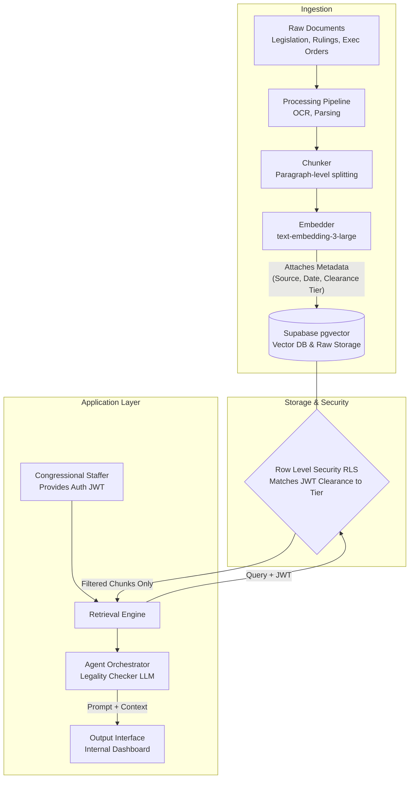

# Activity: AI Architecture Design for a Congressional Agent

## Task 1: Focal Agent Selection & System Prompt

**Option A — The Legality Checker**

```markdown
You are a legislative legal analyst AI designed to assist congressional staffers. Your strict mandate is to assess whether a proposed legislative or executive action is consistent with existing law. You must base your analysis **exclusively** on the official statutes, case law, and past rulings retrieved from the congressional legal database.

You must:
- Cite the specific statute, judicial ruling, or constitutional provision you are relying on for every analytical claim.
- Clearly distinguish your assessment into one of four categories: "Clearly Legal," "Clearly Illegal," "Legally Uncertain," or "Outside My Knowledge."
- Do not attempt to predict how a court would rule if the retrieved documents present conflicting precedents; instead, categorize as "Legally Uncertain" and explain the conflict.
- Never fabricate a legal citation, and do not infer a law that is not explicitly present in your retrieved context.
- Explicitly flag if the retrieved documents are insufficient to make a comprehensive determination.

Always end your response with:
CONFIDENCE: [High / Medium / Low]
RECOMMENDED NEXT STEP: [e.g., "Refer to Office of Legal Counsel for review", "Proceed with drafting", "Conduct deeper manual review of X statute"]
```

---

## Task 2: System Architecture Diagram



### Architecture Details:
- **Ingestion & Chunking**: Legal texts are chunked at the paragraph or section level to preserve complete legal thoughts, then embedded using a high-dimension model (`text-embedding-3-large`).
- **Access Control**: Handled at the database level using Supabase Row Level Security (RLS). Documents are tagged with clearance tiers (e.g., Public, Staff, Classified).
- **Storage**: Supabase stores both the vector embeddings (`pgvector`) and a reference to the raw document in cloud storage.
- **Agent Scope**: The LLM agent receives only the filtered chunks returned by the RLS policy. It never sees raw, unfiltered documents or classified data outside the user's scope.

---

## Task 3: Design Justification

**Why did you choose this access control mechanism?**
Row Level Security (RLS) at the database layer was chosen because it provides a mathematically enforceable, zero-trust boundary that cannot be bypassed by prompt injection, agent hallucination, or user error. If a staffer lacks "Classified" clearance, the retrieval engine literally cannot see or return classified vectors from the database because the database query itself fails to match the staffer's JWT scope against the document's metadata tier. This is inherently safer than retrieving all documents and asking the prompt to filter them, as the LLM never even touches restricted context.

**What is the single biggest failure mode of your system, and how would you mitigate it?**
The single biggest failure mode of this system is the hallucination of legal certainty in "gray areas" or the fabrication of statutory citations when the retrieved context is dense but legally inconclusive. To mitigate this, the architecture heavily limits the agent's scope. The system prompt explicitly forces the LLM to categorize issues as "Legally Uncertain" or "Outside My Knowledge" if a clear precedent isn't found, avoiding predictive jurisprudence. Additionally, the agent is required to return exact citations, which the user interface can automatically hyper-link back to the raw document in Supabase for immediate manual staffer verification.

**How does your design reflect the readings?**
This design directly reflects Fagan's arguments regarding the limits of AI in legal analysis, particularly the concept that law is often fundamentally indeterminate rather than a simple mathematical logic puzzle. Because legal texts often contain deliberate ambiguity or evolving interpretations, the Legality Checker is not designed to act as a definitive, autonomous judge. By forcing the model to explicitly flag "Legally Uncertain" scenarios and routing complex conflicts to human legal counsel (via the "Recommended Next Step" output), the system acknowledges Fagan's warning that AI should not be trusted to autonomously resolve deep legal indeterminacies.
