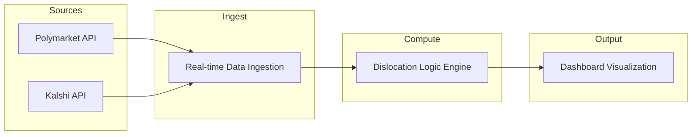

# 📊 Prediction Market Dislocation Analyzer (PMDA)


---

## Table of Contents

- [🧐 About](#-about)
- [🏗️ Architecture](#️-architecture)
- [🛠️ Tech Stack](#️-tech-stack)
- [🚀 Getting Started](#-getting-started)
- [📉 Results/Demo](#-resultsdemo)
- [👥 Team](#-team)

---

## 🧐 About

**Prediction Market Dislocation Analyzer (PMDA)** compares event odds across two prediction markets—**Polymarket** (crypto, Polygon) and **Kalshi** (regulated, USD)—to detect arbitrage opportunities. The tool ingests real-time odds, runs a dislocation logic engine to flag mispricings, and surfaces results in a dashboard for analysis and decision-making.

---

## 🏗️ Architecture

PMDA is built as a pipeline: **ingest → compute → visualize**. Data flows from both market APIs into a unified layer, the Dislocation Logic Engine computes spread and threshold checks, and the Dashboard renders time-series and alert views.



**Data flow (high level):**

1. **Ingestion** — Poll Polymarket (Polygon/crypto) and Kalshi (USD) for matching or comparable events; normalize odds and timestamps.
2. **Dislocation Engine** — Compare odds per event (or outcome); apply thresholds and rules to flag arbitrage (e.g., implied probabilities that cross a spread).
3. **Dashboard** — Display current dislocations, history, and key metrics (e.g., spread, confidence).

---

### Project layout

```text
.
├── src/
│   ├── ingest/          # API clients and data ingestion
│   ├── engine/          # Dislocation logic and thresholds
│   └── dashboard/       # Visualization and UI
├── config/              # API keys, thresholds, mapping configs
├── data/                # Cached or sample market data (optional)
├── tests/
├── requirements.txt
├── README.md
└── LICENSE
```

---

## 🛠️ Tech Stack

| Layer        | Technology | Role |
|-------------|------------|------|
| Language    | Python 3.9+ | Runtime and scripting |
| Data        | Pandas | Normalization, joins, time-series for odds and dislocations |
| Visualization | Matplotlib | Charts and dashboard figures |
| Exchange APIs | CCXT (if applicable) / custom clients | Polymarket and Kalshi connectivity |

- **Pandas**: Event/outcome tables, odds alignment, spread and dislocation metrics.
- **Matplotlib**: Time-series of odds and dislocation scores; summary plots for the dashboard.
- **CCXT**: Use only if Polymarket is accessed via a supported exchange; otherwise use direct REST clients for Polymarket and Kalshi.

---

## 🚀 Getting Started

### Prerequisites

- Python 3.9 or higher.
- (Optional) API keys or credentials for Polymarket and Kalshi where required by your ingestion layer.

### Installation

```bash
# Clone the repository (replace with your repo URL)
git clone https://github.com/your-org/pmda.git
cd pmda

# Create a virtual environment to isolate dependencies
python -m venv .venv
source .venv/bin/activate   # On Windows: .venv\Scripts\activate

# Install dependencies from requirements.txt
pip install -r requirements.txt
```

### Configuration

- Place API keys or config in `config/` (e.g., `.env` or `config.yaml`). Do not commit secrets.
- Set dislocation thresholds and event-matching rules in config so the engine and dashboard use consistent parameters.

### Run the pipeline

```bash
# Run ingestion and dislocation engine (example entrypoint)
python -m src.ingest.run

# Run dashboard (example; adjust to your entrypoint)
python -m src.dashboard.run
```

Adjust module paths to match your actual package layout (e.g., `src/ingest/run.py`, `src/dashboard/run.py`).

---

## 📉 Results/Demo

- **Dashboard**: Open the dashboard after running the pipeline to view current dislocations, time-series of odds, and any alerts.
- **Outputs**: The Dislocation Logic Engine produces tables (e.g., CSV or in-memory DataFrames) of events with spread, threshold breach, and recommended direction; the dashboard consumes these for visualization.
- **Interpretation**: Positive dislocation for an outcome means one market implies a higher probability than the other; the engine and dashboard help identify tradable spreads subject to your risk and execution constraints.

---

## 👥 Team

- **Daniel Atik**
- **Masaab Sohaib**
- **Jan Chu**

---

*PMDA is for research and educational use. Trading on prediction markets may be subject to regulation and risk; verify compliance and suitability before any real capital deployment.*
